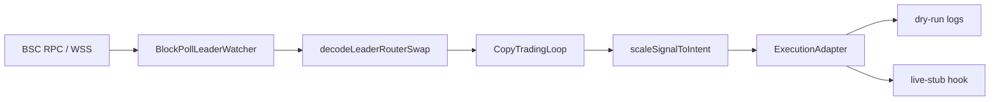

# Pancake Copy Companion #1

**Follow smart-money router swaps on BNB Chain — learn the mechanics, stay in dry-run until you are ready.**

A TypeScript companion for studying how [PancakeSwap](https://pancakeswap.finance/) V2-style copy trading works on **BNB Smart Chain**. Point it at wallet addresses you want to observe, watch their router activity block-by-block, and see exactly what a follower wallet *would* submit — without sending a single transaction by default.

> **Not financial advice.** On-chain trading carries real risk: failed transactions, MEV, illiquid pools, smart-contract bugs, and total loss of funds. Run `EXECUTION_MODE=dry-run` until you understand every line you would change for live execution.

**Node 20+** · **TypeScript (strict)** · **ethers v6** · **PancakeSwap V2 router** · **dry-run by default**

---

## Why this repo exists

Most “copy trading bot” tutorials skip the interesting part: **how do you actually detect a leader swap, decode it, size it, and decide what to send next?** This project keeps that pipeline visible:

| You want to… | This repo gives you… |
| --- | --- |
| Learn how router calldata is structured | Decoders for `swapExact*` on the canonical Pancake V2 router |
| Experiment without risking keys | `dry-run` executor that logs intents only |
| Extend toward production safely | `ExecutionAdapter` interface + `live-stub` hook for your signer |
| Restart without missing recent history | Configurable block lookback on startup |
| Tune how aggressively you mirror size | Basis-point style `SIZE_NUMERATOR_BP` / `SIZE_DENOMINATOR_BP` |

---

## Quick start

**1. Install** Node.js 20 or newer.

**2. Clone and install dependencies:**

```bash
cd pancakeswap-copy-trading_bot_1
npm install
```

**3. Configure environment:**

```bash
cp .env.example .env
```

Edit `.env` — at minimum set a reliable BSC RPC URL and one or more leader addresses (for learning/research only):

```env
RPC_URL_BSC=https://bsc-dataseed.binance.org
LEADER_ADDRESSES=0xYourLeaderAddressHere
EXECUTION_MODE=dry-run
```

**4. Run in development (watch mode, auto-reload):**

```bash
npm run dev
```

**5. Production build:**

```bash
npm run build && npm start
```

When a watched leader hits the PancakeSwap V2 router with a supported swap, you will see logs like:

```text
mirroring leader router call { leader, correlatesTo, kind }
dry-run (no on-chain tx) { reference, path }
```

Press `Ctrl+C` to stop. The shutdown line reports how many follower intents were staged during the session.

---

## How it works



1. **Watch** — `BlockPollLeaderWatcher` polls chain head on a fixed interval (`POLL_INTERVAL_MS`). On first run it scans the last `LOOKBACK_BLOCKS`; afterward it advances from the last processed block so restarts do not skip recent activity.
2. **Filter** — Only transactions whose `from` is in `LEADER_ADDRESSES` and whose `to` is the PancakeSwap V2 router (`0x10ED…4024E`) are considered.
3. **Decode** — Calldata is parsed with ethers `Interface` against three common router methods (see below). ETH-in swaps hydrate `amountInWei` from the transaction `value` field.
4. **Dedupe** — `CopyTradingLoop` keys on the leader transaction hash so the same swap is never mirrored twice.
5. **Size** — `scaleSignalToIntent` applies your ratio: `scaledAmount = leaderAmount × NUMERATOR / DENOMINATOR`.
6. **Execute** — `ExecutionAdapter` receives a `FollowerIntent`. In `dry-run`, nothing is broadcast. In `live-stub`, you get a explicit warning and a placeholder reference — wire your signer here when ready.

---

## Architecture (source layout)

| Path | Responsibility |
| --- | --- |
| `src/index.ts` | Bootstraps config, logger, watcher, copy loop, and graceful shutdown |
| `src/watch/blockPollWatcher.ts` | RPC provider, block polling, leader tx filtering |
| `src/router/decodeLeaderSwap.ts` | Router calldata → `SwapSignal` |
| `src/router/routerAbi.ts` | ABI fragments for supported swap selectors |
| `src/engine/copyLoop.ts` | Dedup + orchestration from signal to executor |
| `src/engine/sizing.ts` | Proportional sizing math (`bigint`-safe) |
| `src/executor/` | `dry-run` and `live-stub` adapters behind `ExecutionAdapter` |
| `src/config.ts` | Zod-validated `.env` loading |
| `src/constants.ts` | Router address and chain constants |

### Supported leader swap types

| Router method | `SwapSignal.kind` | Notes |
| --- | --- | --- |
| `swapExactTokensForTokens` | `exact-tokens` | Full amount in from calldata |
| `swapExactETHForTokens` | `exact-eth-in` | Amount in from tx `value` |
| `swapExactTokensForETH` | `exact-eth-out` | BNB out path |

Other router methods (fee-on-transfer variants, multihop aggregators, limit orders) are **ignored** until you extend `decodeLeaderRouterSwap.ts`.

### Core types

- **`SwapSignal`** — what the leader did on-chain (path, amounts, correlation hash).
- **`FollowerIntent`** — same signal plus `scaledAmountInWei` / `scaledAmountOutMinWei` for your follower wallet.

---

## License

MIT — build responsibly, disclose risks clearly, and treat other people's capital with care.
