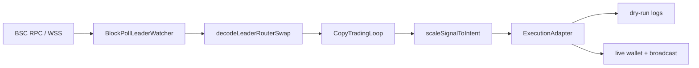

# Pancake Copy Companion #1

**Follow smart-money router swaps on BNB Chain — learn the mechanics, stay in dry-run until you are ready.**

A TypeScript companion for studying how [PancakeSwap](https://pancakeswap.finance/) V2-style copy trading works on **BNB Smart Chain**. Point it at wallet addresses you want to observe, watch their router activity block-by-block, and see exactly what a follower wallet *would* submit — without sending a single transaction by default.

> **Not financial advice.** On-chain trading carries real risk: failed transactions, MEV, illiquid pools, smart-contract bugs, and total loss of funds. Run `EXECUTION_MODE=dry-run` until you understand every line you would change for live execution.

**Node 20+** · **TypeScript (strict)** · **ethers v6** · **PancakeSwap V2 router** · **dry-run by default**

---

## Why this repo exists

Most “copy trading bot” tutorials skip the interesting part: **how do you actually detect a leader swap, decode it, size it, and decide what to send next?** This project keeps that pipeline visible:

| You want to… | This repo gives you… |
| --- | --- |
| Learn how router calldata is structured | Decoders for `swapExact*` on the canonical Pancake V2 router |
| Experiment without risking keys | `dry-run` executor that logs intents only |
| Extend toward production safely | `ExecutionAdapter` with a live `ethers.Wallet` executor that signs router swaps |
| Restart without missing recent history | Configurable block lookback + optional Redis cache for block head and seen leader txs |
| Tune how aggressively you mirror size | Basis-point style `SIZE_NUMERATOR_BP` / `SIZE_DENOMINATOR_BP` |

---

## Quick start

**1. Install** Node.js 20 or newer.

**2. Clone and install dependencies:**

```bash
cd pancakeswap-copy-trading_bot_1
npm install
```

**3. Configure environment:**

```bash
cp .env.example .env
```

Edit `.env` — at minimum set a reliable BSC RPC URL and one or more leader addresses (for learning/research only):

```env
RPC_URL_BSC=https://bsc-dataseed.binance.org
LEADER_ADDRESSES=0xYourLeaderAddressHere
EXECUTION_MODE=dry-run
```

To **sign and broadcast real swaps**, switch to live mode and fund the follower wallet on BSC:

```env
EXECUTION_MODE=live
FOLLOWER_PRIVATE_KEY=0xYourFollowerPrivateKeyHere
TX_DEADLINE_SECONDS=300
```

**Never commit `FOLLOWER_PRIVATE_KEY`.** Keep it only in `.env` (gitignored). Start with tiny sizes and a dedicated hot wallet — not your main holdings.

**4. Run in development (watch mode, auto-reload):**

```bash
npm run dev
```

**5. Production build:**

```bash
npm run build && npm start
```

When a watched leader hits the PancakeSwap V2 router with a supported swap, you will see logs like:

```text
mirroring leader router call { leader, correlatesTo, kind }
dry-run (no on-chain tx) { reference, path }
```

Press `Ctrl+C` to stop. The shutdown line reports how many follower intents were staged during the session.

---

## How it works



1. **Watch** — `BlockPollLeaderWatcher` polls chain head on a fixed interval (`POLL_INTERVAL_MS`). On first run it scans the last `LOOKBACK_BLOCKS`; afterward it advances from the last processed block so restarts do not skip recent activity.
2. **Filter** — Only transactions whose `from` is in `LEADER_ADDRESSES` and whose `to` is the PancakeSwap V2 router (`0x10ED…4024E`) are considered.
3. **Decode** — Calldata is parsed with ethers `Interface` against three common router methods (see below). ETH-in swaps hydrate `amountInWei` from the transaction `value` field.
4. **Dedupe** — `CopyTradingLoop` keys on the leader transaction hash so the same swap is never mirrored twice.
5. **Size** — `scaleSignalToIntent` applies your ratio: `scaledAmount = leaderAmount × NUMERATOR / DENOMINATOR`.
6. **Execute** — `ExecutionAdapter` receives a `FollowerIntent`. In `dry-run`, nothing is broadcast. In `live`, `LiveExecutor` approves ERC-20 inputs when needed, signs the matching Pancake router call, waits for confirmation, and logs the transaction hash.

---

## Architecture (source layout)

| Path | Responsibility |
| --- | --- |
| `src/index.ts` | Bootstraps config, logger, watcher, copy loop, and graceful shutdown |
| `src/watch/blockPollWatcher.ts` | RPC provider, block polling, leader tx filtering |
| `src/router/decodeLeaderSwap.ts` | Router calldata → `SwapSignal` |
| `src/router/routerAbi.ts` | ABI fragments for supported swap selectors |
| `src/engine/copyLoop.ts` | Dedup + orchestration from signal to executor |
| `src/engine/sizing.ts` | Proportional sizing math (`bigint`-safe) |
| `src/chain/createBscProvider.ts` | Shared BSC JSON-RPC / WebSocket provider factory |
| `src/executor/` | `dry-run` and `live` adapters behind `ExecutionAdapter` |
| `src/config.ts` | Zod-validated `.env` loading |
| `src/constants.ts` | Router address and chain constants |

### Supported leader swap types

| Router method | `SwapSignal.kind` | Notes |
| --- | --- | --- |
| `swapExactTokensForTokens` | `exact-tokens` | Full amount in from calldata |
| `swapExactETHForTokens` | `exact-eth-in` | Amount in from tx `value` |
| `swapExactTokensForETH` | `exact-eth-out` | BNB out path |

Other router methods (fee-on-transfer variants, multihop aggregators, limit orders) are **ignored** until you extend `decodeLeaderRouterSwap.ts`.

### Core types

- **`SwapSignal`** — what the leader did on-chain (path, amounts, correlation hash).
- **`FollowerIntent`** — same signal plus `scaledAmountInWei` / `scaledAmountOutMinWei` for your follower wallet.

---

## Configuration reference

| Variable | Default | Description |
| --- | --- | --- |
| `RPC_URL_BSC` | *(required)* | HTTP or WebSocket JSON-RPC endpoint for BSC mainnet (chain id 56) |
| `LEADER_ADDRESSES` | *(required)* | Space- or comma-separated `0x` addresses to watch (case-insensitive) |
| `POLL_INTERVAL_MS` | `3500` | Milliseconds between block-head polls |
| `LOOKBACK_BLOCKS` | `30` | Blocks scanned from head on startup / after lag |
| `SIZE_NUMERATOR_BP` | `1000` | Follower size numerator (basis-point style integer) |
| `SIZE_DENOMINATOR_BP` | `10000` | Follower size denominator — e.g. `1500/10000` = 15% of leader size |
| `EXECUTION_MODE` | `dry-run` | `dry-run` (log only) or `live` (sign + broadcast with `FOLLOWER_PRIVATE_KEY`) |
| `FOLLOWER_PRIVATE_KEY` | *(unset)* | **Required for `live`.** 32-byte hex private key for the follower wallet |
| `TX_DEADLINE_SECONDS` | `300` | Router swap deadline offset in seconds (`live` mode) |
| `VERBOSE_LOGS` | off | Set `1` or `true` for richer trace output |

### Sizing examples

| Numerator | Denominator | Effect |
| --- | --- | --- |
| `1000` | `10000` | Mirror 10% of leader input |
| `1500` | `10000` | Mirror 15% |
| `5000` | `10000` | Mirror 50% |
| `10000` | `10000` | 1:1 sizing (still dry-run until you change execution) |

Sizing applies to both `amountIn` and `amountOutMin` proportionally. Slippage tolerance mirrors the leader's ratio — tune carefully before live use.

### Execution modes

| Mode | Behavior | When to use |
| --- | --- | --- |
| `dry-run` | Logs `FollowerIntent`; **no wallet, no broadcast** | Learning, debugging decoders, tuning leaders |
| `live` | Signs router swaps with `FOLLOWER_PRIVATE_KEY`, submits approvals when needed, waits for receipts | Real copy trading on BSC — use a funded hot wallet and conservative sizing |

Live mode validates `FOLLOWER_PRIVATE_KEY` at startup (Zod). The executor handles `swapExactTokensForTokens`, `swapExactETHForTokens`, and `swapExactTokensForETH` against the canonical Pancake V2 router. **Never commit private keys.**

---

## Development

```bash
npm run dev        # tsx watch — iterate quickly
npm run typecheck  # tsc --noEmit
npm run build      # emit dist/
npm test           # vitest — sizing math unit tests
```

### Testing

```bash
npm test
```

Today tests cover proportional sizing in `src/engine/sizing.test.ts`. Extend with fixture calldata tests when you add decoders.

### Troubleshooting

| Symptom | Likely cause | Fix |
| --- | --- | --- |
| No logs after start | Leaders inactive or wrong addresses | Verify `LEADER_ADDRESSES`; pick active wallets on BscScan |
| RPC errors / stalls | Public endpoint rate limits | Use a dedicated BSC RPC; try WSS for lower latency |
| Missed swaps after restart | Lookback too small | Increase `LOOKBACK_BLOCKS` (max 500) |
| Swaps not detected | Non-V2 router or unsupported method | Confirm tx targets `0x10ED…4024E`; extend decoder if needed |
| `Invalid environment` on boot | Zod validation failed | Check `.env` types — numerics must be integers; `live` requires a valid 32-byte `FOLLOWER_PRIVATE_KEY` |
| Live tx reverts | Insufficient BNB for gas, bad slippage, or unfunded token balance | Fund follower wallet; reduce sizing; check token approvals in logs |

---

## Roadmap ideas

- Decode fee-on-transfer and `swapExact*` variant selectors
- Pool liquidity / price-impact guard before submitting follower txs
- Per-leader sizing profiles and cooldown windows
- Telegram or webhook alerts on mirrored intents
- Private RPC + bundle submission research (advanced)

---

## License

MIT — build responsibly, disclose risks clearly, and treat other people's capital with care.
